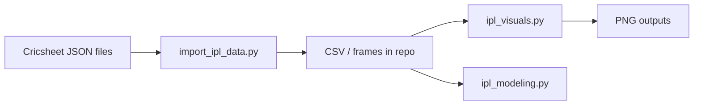

# IPL analytics

Exploratory analysis and modeling on Indian Premier League ball-by-ball JSON
from Cricsheet. Scripts import the bundled dataset, build aggregates, and emit
charts for batting and team trends.

## Architecture



## Data

`README.txt` documents the Cricsheet IPL archive provenance. JSON match files
sit alongside the Python tooling in this repository.

## Run

```bash
python3 import_ipl_data.py
python3 ipl_visuals.py
python3 ipl_modeling.py
```

Use a virtual environment if you add dependencies beyond the standard library
and plotting stack already referenced in the scripts.

## License

Cricket data © Cricsheet contributors; code MIT unless noted in file headers.
