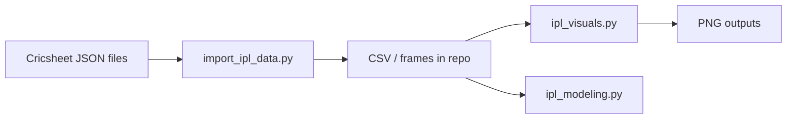

# IPL analytics

Exploratory analysis and modeling on Indian Premier League ball-by-ball JSON
from Cricsheet. Scripts import the bundled dataset, build aggregates, and emit
charts for batting and team trends.

## Architecture



## Data

`README.txt` documents the Cricsheet IPL archive provenance. JSON match files
sit alongside the Python tooling in this repository.

## Run

```bash
make setup
make all
```

Or run stages individually: `make ingest`, `make visuals`, `make model`.
Pipeline details are in `docs/ARCHITECTURE.md`.

## License

Cricket data © Cricsheet contributors; code MIT unless noted in file headers.
