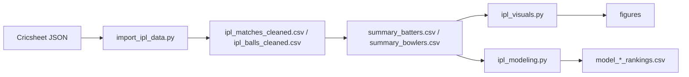

# IPL (Cricsheet)

Ball-by-ball **Indian Premier League** analytics on Cricsheet JSON: ETL into cleaned CSVs, exploratory visuals, and sklearn models for rankings and match outcomes.

## Pipeline



`import_ipl_data.py` walks the bundled archive (see `README.txt` for provenance and match index). Downstream scripts assume cleaned tables exist.

## Modeling (`ipl_modeling.py`)

- Composite **batting** and **bowling** scores (rate + volume weighting)
- **RandomForest** / **LogisticRegression** experiments on match outcomes
- Cross-validation and holdout metrics; exports ranked CSVs for inspection

## Visuals (`ipl_visuals.py`)

Matplotlib, Seaborn, Plotly, and NetworkX charts: team trends, player comparisons, 3D and network views where useful.

## Run

```bash
make setup    # venv + requirements.txt
make all      # ingest → visuals → model
```

Stages: `make ingest`, `make visuals`, `make model`. Details in `docs/ARCHITECTURE.md`.

## Dependencies

Pinned in `requirements.txt` (pandas, numpy, scikit-learn, plotly, tqdm, etc.).

## Data

Cricket data © Cricsheet contributors. Code MIT unless noted in file headers.
