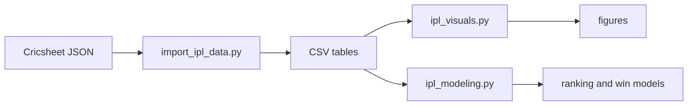

# IPL analytics pipeline

## Stages

1. **Import** flattens ball-by-ball JSON into `ipl_matches_cleaned.csv`,
   `ipl_balls_cleaned.csv`, and batter/bowler summary tables.
2. **Visuals** builds exploratory charts (team trends, network views, 3D plots).
3. **Modeling** trains classifiers for match outcomes and exports composite
   batting and bowling rankings.

Each stage is idempotent against the same inputs: re-run `make all` after
refreshing JSON under the data directory.
